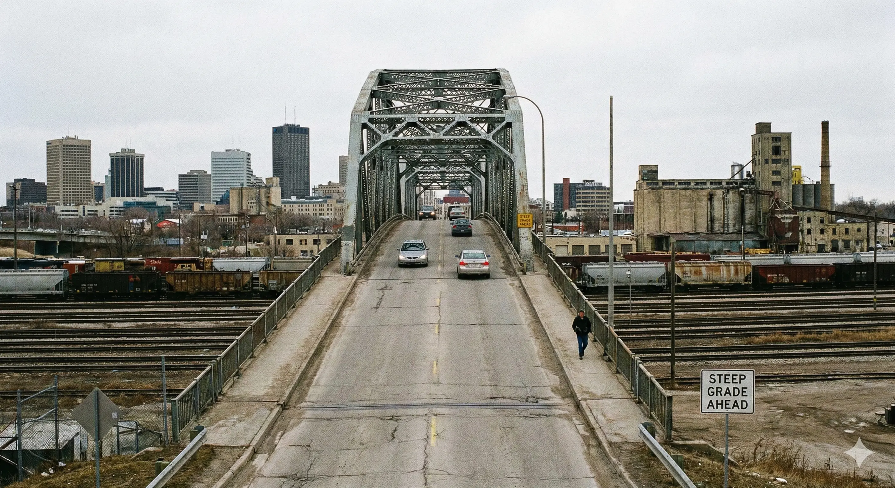

If you’ve ever driven north on Arlington Street, you know "The Hump." You hit that sudden, terrifying incline, your engine roars, and for a split second, you can't see anything over the crest except the sky.

For over 110 years, the **Arlington Bridge** has spanned the massive CPR rail yards, connecting the North End to the West End. But as of late 2023, the bridge is closed indefinitely, and its future looks grim.

Before it comes down, let's look at why this rusty iron giant is the stuff of Winnipeg legend.

## The "Nile River" Myth

Ask any old-timer in a Transcona coffee shop, and they’ll tell you the same story: **"That bridge wasn't meant for Winnipeg. It was built for the Nile River in Egypt."**

The legend goes like this:
* The **Cleveland Bridge & Engineering Company** (in England) built a bridge for the Nile.
* The Egyptians (or the British colonial government) refused to pay for it, or it didn't fit.
* The company was stuck with a massive iron bridge sitting in a yard in the UK.
* Winnipeg, looking for a bargain in 1911, bought it "on the cheap" and shipped it over.

It’s a great story. It explains why the bridge looks so out of place, why the steel is so heavy, and why it seems "over-engineered" for a simple rail yard crossing.

### The Reality Check
Historians (and City of Winnipeg engineers) have looked for the receipt for decades. **They never found one.**

Most experts now agree that the bridge was likely commissioned specifically for Winnipeg. However, local historian Christian Cassidy has noted that the Cleveland Bridge company *was* actively surveying the Blue Nile in Sudan at the exact same time. It is possible the *design* was recycled from a cancelled African project, even if the steel wasn't physically shipped back and forth.

## The "Streetcar Boycott" of 1912

Whether it was meant for the Nile or not, one thing is undeniably true: **It was too steep for Winnipeg.**

When the bridge opened in **1912**, it was supposed to carry streetcars (trolleys). But there was a problem. The approach grade was **7.1%**. That is incredibly steep for steel wheels on steel rails.

Streetcar operators took one look at the "Arlington Hump" and refused to drive over it. They terrified city officials with scenarios of:
1.  Brakes failing on the way down.
2.  Streetcars sliding uncontrollably into traffic on Logan or Dufferin Avenue.
3.  The motors burning out trying to climb the hill.

The tracks were laid, but no streetcar ever carried a passenger across it. In fact, buses were eventually banned from the bridge in the 1960s for similar reasons.

## The End of the Line

Today, the bridge sits silent. After 112 years of corrosion from the steam trains and diesel locomotives below, the steel has finally given up.

As of late 2024, city reports recommend a full demolition and a replacement estimated at **$166 million**. The new design would likely be much longer, smoothing out that famous "hump" to a gentler 5% grade.

It will be safer, sure. But it won't have the same story. Goodbye, Arlington. You were the weirdest bridge in the city, and we loved you for it.