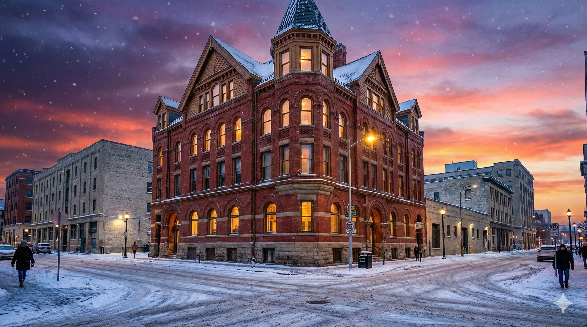

如果你经常在温尼伯的 **Exchange District**（交易所区）闲逛，你可能会习惯那一排排高大的工业仓库和旧厂房。但是，当你走到 Adelaide Street 88号时，你会看到一座显得有些“格格不入”的建筑——**Kelly House**。

在一片商业巨擘的建筑群中，这栋精致的维多利亚式红砖房就像是一个来自1880年代的时间胶囊。今天，我们就来聊聊这座房子的故事，以及它背后的那位让曼尼托巴人“爱恨交织”的主人。

## 这里的“幸存者”

建于 **1882年至1883年** 之间，Kelly House 是 Exchange District 早期繁荣岁月的见证者。

咱们都知道，现在的 Exchange District 是北美保存最完整的20世纪初仓库区。但在这些大仓库拔地而起之前，这一带其实是一个颇为高档的住宅区。随着铁路的开通和城市的扩张，商业建筑逐渐吞噬了住宅，绝大多数的老房子都被拆除了。

Kelly House 是极少数幸存下来的民宅之一。它顽强地屹立在 Bannatyne Avenue 和 Adelaide Street 的拐角处，看着周围的邻居从家庭变成了工厂。

## 屋主：臭名昭著的 Thomas Kelly

这就得提到这座房子的主人——**Thomas Kelly**。

对于熟悉曼尼托巴历史的朋友来说，“Kelly”这个名字通常和 **曼尼托巴省议会大楼（Manitoba Legislative Building）** 联系在一起，而且名声并不太好。

Thomas Kelly 是当年温尼伯顶级的承包商。他靠着砖石生意起家，这栋 Kelly House 就是他实力的展示——整栋房子使用了高品质的红砖，即便是在今天，那些砖石结构依然坚固美观。

然而，让 Kelly 在历史上“留名”的，是他在建造省议会大楼时的贪腐丑闻。他被指控偷工减料、虚报预算，这桩丑闻最终导致了当时罗布林（Roblin）省政府的倒台。虽然 Kelly House 是在他陷入那场巨大丑闻之前的住所，但看着这座房子，你依然能感受到这位爱尔兰移民当年的野心和财力。

## 建筑特色

哪怕你对历史不感兴趣，光看建筑，Kelly House 也是个精品。

* **风格**：这是一种带有意大利风格（Italianate）特征的维多利亚建筑。
* **细节**：注意看它的窗户拱门和飞檐，这些装饰性的砖石工艺在当时是非常昂贵的。
* **修复**：这栋楼在近代经过了精心的修复。它没有被拆除重建，而是被改造为了商业办公空间，这是温尼伯在历史建筑“适应性再利用”（Adaptive Re-use）方面的一个极好案例。

## 为什么值得一看？

下次你去 Exchange District 喝咖啡或者去参加 Fringe Festival 的时候，不妨绕道去 88 Adelaide Street 看看。

它不仅仅是一堆砖头，它是温尼伯从一个新兴定居点向大都市转型的缩影。它提醒着我们，在这座城市确立其作为“西方芝加哥”的商业地位之前，这里曾经有人居住、生活，那是属于温尼伯更早期的、更私密的记忆。

**想了解更多温尼伯的隐秘历史或本地钓鱼技巧？记得关注“加拿大大厨师”！**